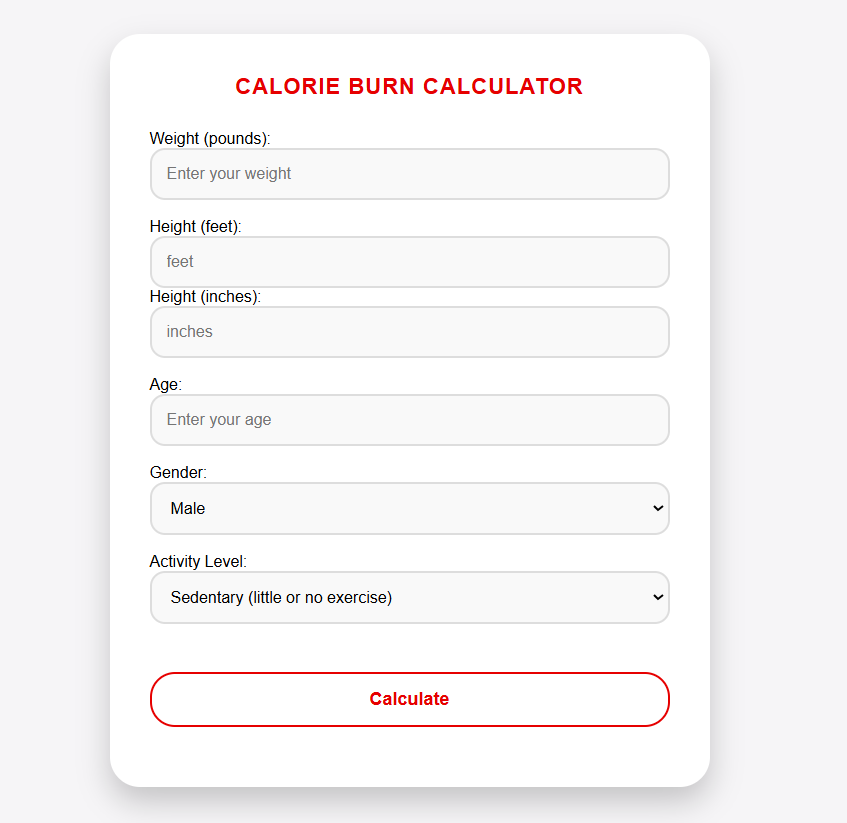

# Calorie Burn Calculator - README

## Project Overview
The **Calorie Burn Calculator** is a web-based application that helps users estimate the number of calories they burn daily based on factors such as weight, height, age, gender, and activity level. The form takes user inputs and calculates an approximate calorie burn based on their physical attributes and activity intensity.

## Features
- **Input Fields**: 
  - **Weight** (in pounds)
  - **Height**: 
    - Feet
    - Inches
  - **Age** (in years)
  - **Gender** (Male/Female/Other)
  - **Activity Level**: Dropdown for selecting activity level (e.g., sedentary, light exercise, active)
  
- **Calculation Button**: Upon clicking the "Calculate" button, the application will use the provided inputs to estimate daily caloric expenditure.
  
- **Responsive UI**: The application interface is built to be clean and responsive for desktop and mobile platforms.

## Technology Stack
- **Frontend**: 
  - HTML5
  - CSS3 for styling
  - JavaScript for user input validation and calorie calculation
  

  
## Calculation Logic
The calorie burn calculation follows the **Mifflin-St Jeor Equation**:
- For males:
  ```
  BMR = 10 * weight(kg) + 6.25 * height(cm) - 5 * age(y) + 5
  ```
- For females:
  ```
  BMR = 10 * weight(kg) + 6.25 * height(cm) - 5 * age(y) - 161
  ```

Once the Basal Metabolic Rate (BMR) is calculated, it is multiplied by the user's activity level to estimate the Total Daily Energy Expenditure (TDEE):
- Sedentary: BMR * 1.2
- Light activity: BMR * 1.375
- Moderate activity: BMR * 1.55
- Active: BMR * 1.725
- Very active: BMR * 1.9

## How to Run the Project
1. Clone the repository: 
   ```bash
   git clone <repository-url>
   ```
2. Open the `index.html` file in any web browser to view and interact with the calorie calculator.


## Future Enhancements
- Add error handling for invalid inputs.
- Include more activity level options.
- Provide visual feedback or charts for calorie estimates.



